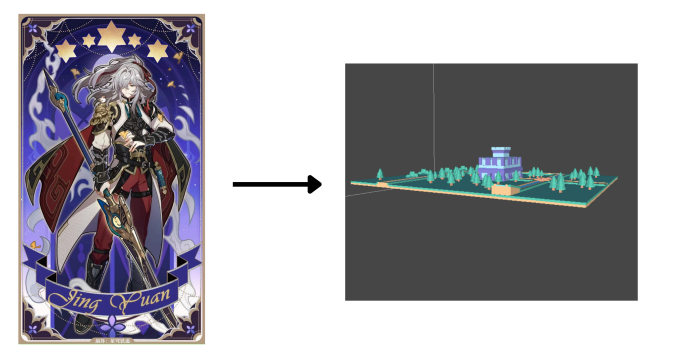
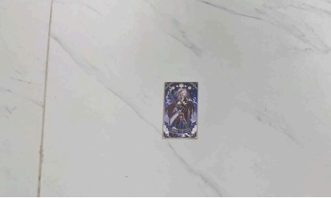
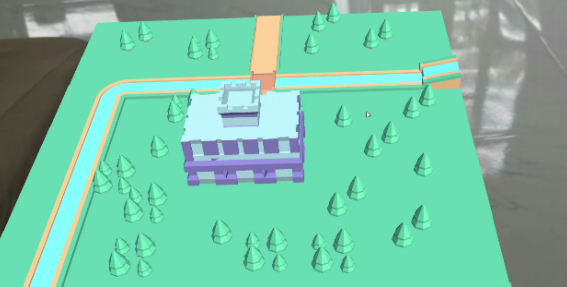
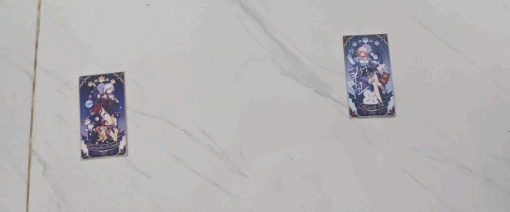
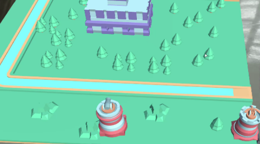
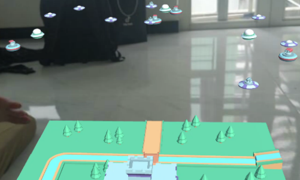
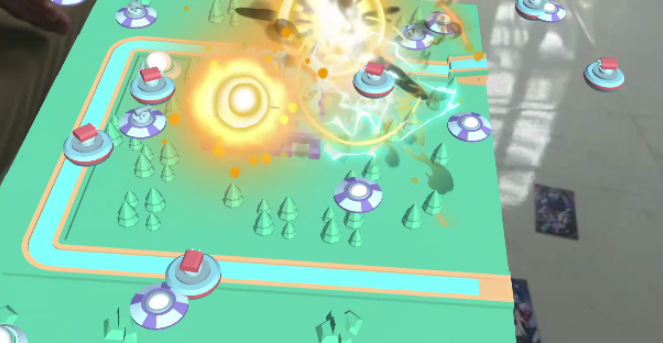
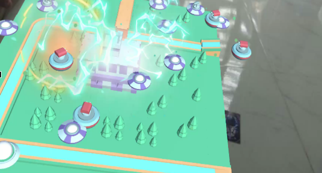

One key aspect of AR-enabled tower defense games is the utilization of physical objects, such as cards, to interact with the virtual elements. Players are often provided with cards representing different types of towers and structures, each contributing to their defensive arsenal. By placing these cards in the real world and observing their effects through AR interfaces, players engage in a unique blend of tactile and digital gameplay
# Tower Defense AR

